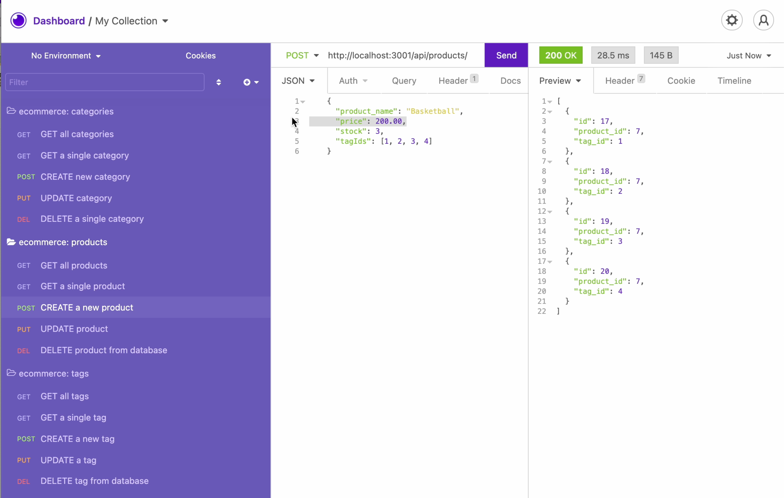

# e-commerce endgame

## Description:
This project is an object-relational mapping (ORM) challenge. It focuses on building the back end of an e-commerce site by taking a working Express.js API, and configuring it to use Sequelize to interact with a MySQL database.

## Table of Contents:
[Project Information](#ecommerce-endgame)<br />[Installation Instructions](#installation-instructions)<br />[Preview](#preview)<br />[Website](#website)<br />[Credits](#credits)<br />[Collaborators](#collaborators)<br />[Questions](#questions)<br />[License](#license)<br />[Made By](#made-by)

## Built With the Following:
- JavaScript
 - ES6
 - Node
 - Express.js
 - MySQL
 - Sequelize

## Installation & How-To Instructions:
 1. Download and install Node.js onto your computer.
 2. Clone this repository or download the project's zip fle.
 3. Navigate to this project's folder from your terminal.
 4. Now install the following node modules:
    - ```npm install express sequelize mysql2 dotenv```
 5. Create a ```.env``` file containing your own SQL username and password. As seen in ``db/schema.sql``, the database's name is ```ecommerce```.
 6. Run ```node server``` or ```npm start``` from the Command Line to check that the server can connect properly.
 7. To check the MySQL schema, close the server (``ctrl +c``), then open and log into MySQL Shell with ``mysql -u <username> -p <password>`` in your terminal. Use the aforementioned database and run ```source db/schema.sql```.
 8. Quit and populate your database tables with the command ``npm run seed``.
 9. Restart the server. Confirm ``GET, POST, PUT,`` and ``DELETE`` endpoints with an API client program like Insomnia.

## Preview:
#### Click the image below to be directed to a brief walk-through video demonstrating this app's functionality.

[](https://drive.google.com/file/d/1G5HbcfoFyQM1wW-UtXOF0digDb4yP44k/view?usp=sharing)

## Credits:
 - Starter code provided by The Coding Bootcamp

## Collaborators:
 - QuickTimePlayer, used to capture screen recording
 - My cats, who, when not screaming at me to play fetch with them, provide warm companionship.

## Github:
[https://github.com/itsmeadriana](https://github.com/itsmeadriana)

## License
[Link](https://choosealicense.com/licenses/mit/)

### Made By
© Copyright 2021 Adriana Nieves
